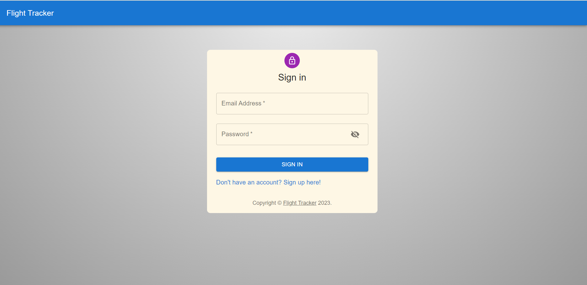

<a name="readme-top"></a>

<!-- PROJECT LOGO -->
<br />
<div align="center">
<a href="https://github.com/SrishtiDharwani/flight-tracker-app">
    
  </a>
  <h3 align="center">Flight Tracker</h3>

  <p align="center">
Your Real-Time Flight Companion
    <br />
    <a href="https://github.com/SrishtiDharwani/flight-tracker-app"><strong>Explore the docs »</strong></a>
    <br />
    <br />
    <a href="https://flight-tracker-one.vercel.app/">View Deployed</a>
    ·
    <a href="https://github.com/SrishtiDharwani/flight-tracker-app/issues">Report Bug</a>
    ·
    <a href="https://github.com/SrishtiDharwani/flight-tracker-app/issues">Request Feature</a>
  </p>
</div>

<!-- TABLE OF CONTENTS -->
<details>
  <summary>Table of Contents</summary>
  <ol>
    <li>
      <a href="#about-the-project">About The Project</a>
      <ul>
        <li><a href="#built-with">Built With</a></li>
      </ul>
    </li>
    <li>
      <a href="#getting-started">Getting Started</a>
      <ul>
        <li><a href="#prerequisites">Prerequisites</a></li>
        <li><a href="#installation">Installation</a></li>
      </ul>
    </li>
    <li><a href="#usage">Screenshots</a></li>
    <li><a href="#contributing">Contributing</a></li>
    <li><a href="#license">License</a></li>
    <li><a href="#contact">Contact</a></li>
  </ol>
</details>

<!-- ABOUT THE PROJECT -->

## About The Project

[![Product Name Screen Shot][product-screenshot]](https://flight-tracker-one.vercel.app/)

Experience the thrill of real-time flight tracking with our app. Whether you're a frequent traveler or just curious about the skies, our intuitive tool keeps you informed about flights worldwide. Get instant updates, departure and arrival times, and stay connected to the world above. Elevate your journey with our live flight tracking app!

<p align="right">(<a href="#readme-top">back to top</a>)</p>

### Built With

The technologies involved in building Arogya Locker are:

[![React][React.js]][React-url]
<br/>
React is a popular front-end JavaScript library that is used to build user interfaces. It provides a simple and flexible way to create dynamic and responsive user interfaces. React is based on a component-based architecture, which makes it easy to reuse and maintain code.

<br/>

[![Node.js][Node.js]][Node.js-url]
<br/>
Node.js is a server-side JavaScript runtime environment that is used to build scalable and high-performance applications. Node.js allows you to use JavaScript on the server-side, which makes it easy to build full-stack web applications with a single language. It provides a rich set of libraries and tools that make it easy to build web applications.

<br/>

[![ExpressJS][ExpressJS]][ExpressJS-url]
<br/>
Express.js is a web application framework that is used to build APIs and handle HTTP requests. It is built on top of Node.js and provides a simple and flexible way to build web applications. With Express.js, you can easily define routes, handle requests, and manage middleware.

<br />

[![MongoDB][MongoDB]][MongoDB-url]
<br/>
MongoDB is a source-available cross-platform document-oriented database program. Classified as a NoSQL database program, MongoDB uses JSON-like documents with optional schemas.
<br/>

<p align="right">(<a href="#readme-top">back to top</a>)</p>

<!-- GETTING STARTED -->

## Getting Started

Step-by Step setup guide:

### Prerequisites

- npm
  ```sh
  npm install npm@latest -g
  ```

### Installation

1. Get a free Google Maps API at [mapsplatform.google.com/](https://mapsplatform.google.com/)

2. Create a free Open Sky account and get the username and password at [opensky-network.org/](https://opensky-network.org/)

3. Get a free AirLabs API at [airlabs.co/](https://airlabs.co/)

4. Create a MongoDB Atlas Cluster and obtain your MongoDB URI from [www.mongodb.com/cloud/atlas](https://www.mongodb.com/cloud/atlas/register)
<!-- 7. In all three folders run:
   ```sh
   npm install --force
   ``` -->

5. Install NPM packages in backend and frontend

   ```sh
   npm install
   ```

   ```sh
   cd backend
   npm install
   ```

_For starting backend:_

6. Create a .env file in backend:

   ```
   JWT_KEY = 'abc123'
   MONGO = 'your-mongodb-uri'

   ```

   Change the `JWT_KEY` to anything you want

7. Run the following command to start server:
   ```sh
   cd backend
   node app.js
   ```

_For starting frontend:_

8. Create a .env file in frontend:

   ```
   REACT_APP_MAP_KEY = 'your-google-maps-api-key'
   REACT_APP_AIRPORT_KEY = 'your-airlabs-api-key'
   REACT_APP_OPENSKY_USERNAME = 'your-opensky-username'
   REACT_APP_OPENSKY_PASSWORD = 'your-opensky-password'
   REACT_APP_API_URL = 'http://localhost:5000' or 'server-deployment-link'

   ```

9. Run the following command to start the React App:

   ```sh
   npm start
   ```

   <p align="right">(<a href="#readme-top">back to top</a>)</p>

<!-- USAGE EXAMPLES -->

## Screenshots

### Identity Management


<br/>

Arogya Locker uses ABHA ID for identity management. The ABHA IDs are stored on the blockchain on user registration and verified on login. Identity is also managed on a category level: Patient, Doctor, Hospital and Diagnostic Centres.

### Filter Results


<br/>

Live flight results can be filtered on the basis of country or time.

### Airport Markers


<br/>

Markers representing airport are present on the map for the selected country. On clicking, the name of the airport is shown.

### Live Flights Information


<br/>

Live flights for the selected country or time are shown with symbols of different colours that are decoded in the information box that appears on clicking. Other information such as the departure airport, arrival airport, altitude, speed, direction (in degrees) is shown.

### Flight Route


<br/>

On clicking on the flight icon, line connecting waypoints from departure airport to the current location and futher till the arrival airport is shown to indicate the flight path.

_For more examples, please refer to the [site](https://flight-tracker-one.vercel.app/)_

<p align="right">(<a href="#readme-top">back to top</a>)</p>

<!-- CONTRIBUTING -->

## Contributing

Contributions are what make the open source community such an amazing place to learn, inspire, and create. Any contributions you make are **greatly appreciated**.

If you have a suggestion that would make this better, please fork the repo and create a pull request. You can also simply open an issue with the tag "enhancement".
Don't forget to give the project a star! Thanks again!

1. Fork the Project
2. Create your Feature Branch (`git checkout -b feature/AmazingFeature`)
3. Commit your Changes (`git commit -m 'Add some AmazingFeature'`)
4. Push to the Branch (`git push origin feature/AmazingFeature`)
5. Open a Pull Request

<p align="right">(<a href="#readme-top">back to top</a>)</p>

<!-- LICENSE -->

## License

Distributed under the MIT License. See `LICENSE.txt` for more information.

<p align="right">(<a href="#readme-top">back to top</a>)</p>

<!-- CONTACT -->

## Contact

Contributors:

[@srivastv_Sahil](https://twitter.com/srivastv_Sahil) - srivastavasahil133@gmail.com

[@SrishtiDharwani](https://twitter.com/SrishtiDharwani) - srishti.dharwani.30@gmail.com

Project Link: [https://github.com/SrishtiDharwani/flight-tracker-app](https://github.com/SrishtiDharwani/flight-tracker-app)

<p align="right">(<a href="#readme-top">back to top</a>)</p>

<!-- MARKDOWN LINKS & IMAGES -->
<!-- https://www.markdownguide.org/basic-syntax/#reference-style-links -->

[contributors-shield]: https://img.shields.io/github/contributors/sahil9510/arogya-locker.svg?style=for-the-badge
[contributors-url]: https://github.com/sahil9510/arogya-locker/graphs/contributors
[forks-shield]: https://img.shields.io/github/forks/sahil9510/arogya-locker.svg?style=for-the-badge
[forks-url]: https://github.com/sahil9510/arogya-locker/network/members
[stars-shield]: https://img.shields.io/github/stars/sahil9510/arogya-locker.svg?style=for-the-badge
[stars-url]: https://github.com/sahil9510/arogya-locker/stargazers
[issues-shield]: https://img.shields.io/github/issues/sahil9510/arogya-locker?style=for-the-badge
[issues-url]: https://github.com/sahil9510/arogya-locker/issues
[license-shield]: https://img.shields.io/github/license/sahil9510/arogya-locker.svg?style=for-the-badge
[license-url]: https://github.com/sahil9510/arogya-locker/blob/main/LICENSE.txt
[linkedin-shield]: https://img.shields.io/badge/-LinkedIn-black.svg?style=for-the-badge&logo=linkedin&colorB=555
[linkedin-url]: https://www.linkedin.com/in/srishti-dharwani/
[product-screenshot]: public/home.png
[React.js]: https://img.shields.io/badge/React-20232A?style=for-the-badge&logo=react&logoColor=61DAFB
[React-url]: https://reactjs.org/
[Node.js]: https://img.shields.io/badge/Node.js-68A063?style=for-the-badge&logo=nodedotjs&logoColor=3C873A
[Node.js-url]: https://nodejs.org/en
[ExpressJS]: https://img.shields.io/badge/ExpressJS-white?style=for-the-badge&logo=express&logoColor=black
[ExpressJS-url]: https://expressjs.com/
[MongoDB]: https://img.shields.io/badge/Mongo%20DB-000000?style=for-the-badge&logo=mongodb&logoColor=00ed64
[MongoDB-url]: https://www.mongodb.com/
